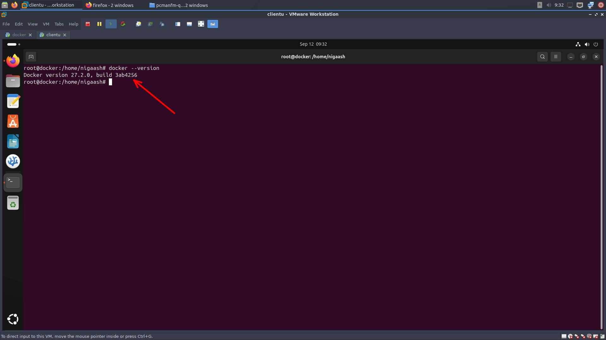
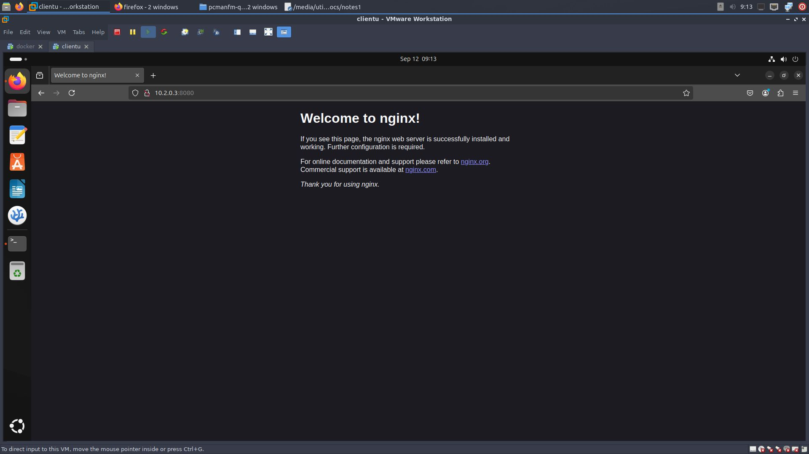
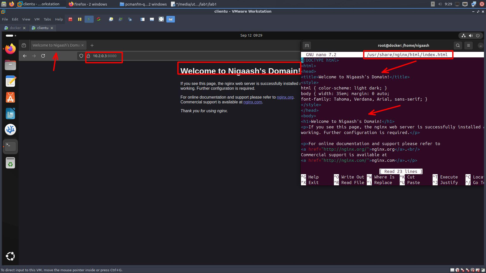
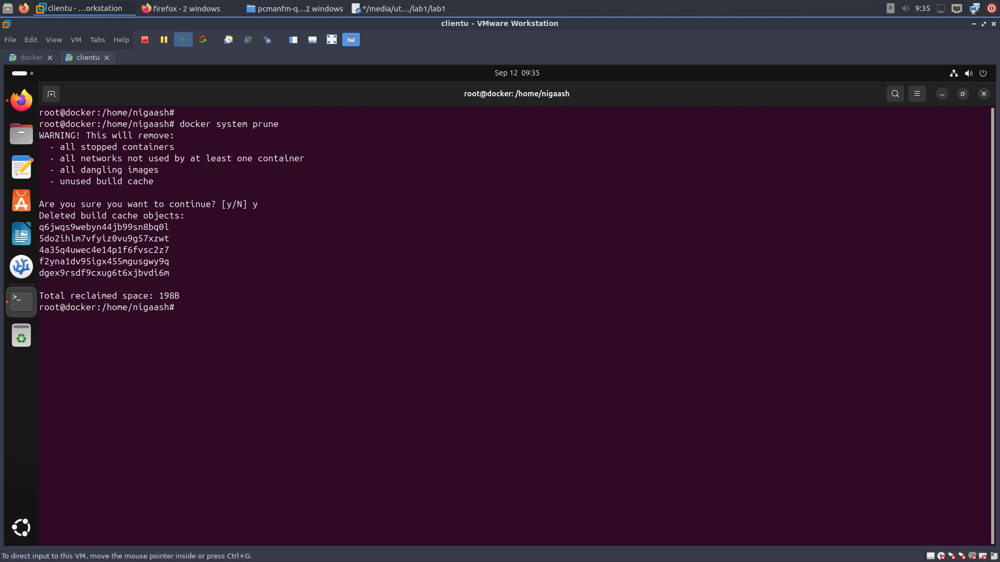
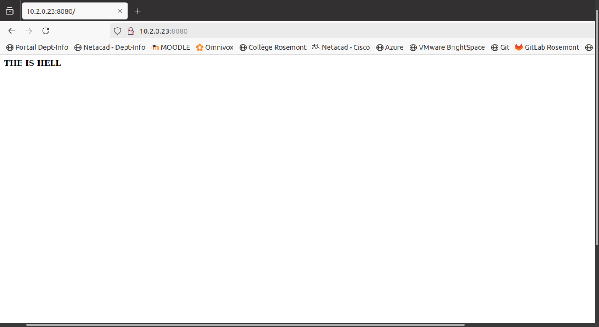

# [Laboratoire 1](<../../labs pdf/Laboratoire-1.pdf>)
## Partie 1
### 1.1 Installer docker sur votre VM
1. Adjouter Docker's official GPG key:
      ```bash
      sudo apt-get update
      sudo apt-get install ca-certificates curl
      sudo install -m 0755 -d /etc/apt/keyrings
      sudo curl -fsSL https://download.docker.com/linux/ubuntu/gpg -o /etc/apt/keyrings/docker.asc
      sudo chmod a+r /etc/apt/keyrings/docker.asc
      ```
2. Adjouter repository à Apt sources:
      ```bash
      echo \
      "deb [arch=$(dpkg --print-architecture) signed-by=/etc/apt/keyrings/docker.asc] https://download.docker.com/linux/ubuntu \
      $(. /etc/os-release && echo "$VERSION_CODENAME") stable" | \
      sudo tee /etc/apt/sources.list.d/docker.list > /dev/null 
      sudo apt-get update
      ```

3. Télécharger docker
    ```bash
    sudo apt-get install docker-ce docker-ce-cli containerd.io docker-buildx-plugin docker-compose-plugin
    ```

4. Tester to see if installed
    ```bash
    sudo docker run hello-world
    ```
    

### 1.2 Monter un serveur nginx de base
1. Pull l'image nginx
    ```
    sudo -i
    docker pull ngnix
    ```
2. Run container with image
    ```
    docker run -d -p 8080:80 --name nigaash nginx
    ```
    

### 1.3-4 Modifer le container

1. Aller dans le container
    ```
    docker exec -it nigaash bash
    ```

2. Faire les modification du index.html
    ```
    sudo apt-get update
    sudo apt install vi
    sudo vi /usr/share/nginx/html/index.html
    ```
    

### 1.4 
1. Nettoyer votre système
        ```
        docker system prune
        ```
        

## Partie 2 Monter un serveur web de base avec docker file
1. pull centos image 
    ```bash
    sudo -i 
    docker pull centos 8
    ```
2. creer dockerfile
    ```
    nano dockerfile
    ```
    ```bash
    from centos:8
    RUN cd /etc/yum.repos.d/
    RUN sed -i 's/mirrorlist/#mirrorlist/g' /etc/yum.repos.d/CentOS-*
    RUN sed -i 's|#baseurl=http://mirror.centos.org|baseurl=http://vault.centos.org|g' /etc/yum.repos.d/CentOS-*
    RUN yum -y update && yum -y install httpd net-tools
    #RUN echo "<hi><b>THE IS HELL</b></hi>" > /var/www/html/index.html
    EXPOSE 80
    #lancer le server en premier plan
    CMD ["/usr/sbin/httpd","-D","FOREGROUND"]
    ```
3. create image from docker file
    ```
    docker build -f dockerfile -t partie_2 .
    ```
4. run container
    ```
    docker run -d - p 8080:80 --name web nigaash partie_2
    ```
    