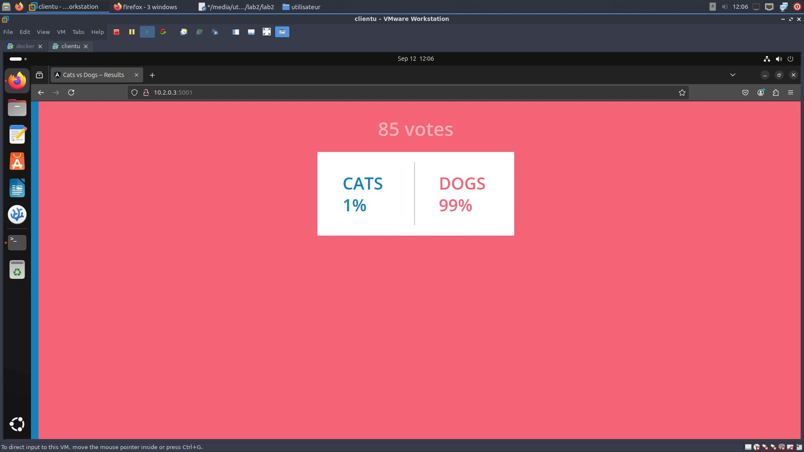

# [Laboratoire 2](<../../labs pdf/Laboratoire-2.pdf>)
## Partie 1 Mettez en place avec docker compose deux services (mysql + web)

1. Installer docker compose

    **si vous avez suivi lab1 docker compose doit etre deja bien installé**

    ```bash
    sudo apt install docker-compose
    docker-compose --version
    ```

2. crée docker compose file

    ```bash
    nano docker-compose.yml
    ```

    ```yaml
    #version: '3'
    services:
      web:
        container_name: server-web
        image: nginx
        ports:
          - "8000:80"
        restart: always
      db:
        container_name: serv_db
        image: mysql:5
        ports:
          - "3306:3306"
        restart: always
        environment:
          MYSQL_ROOT_PASSWORD: "root"
          MYSQL_USER: "nigaash"
          MYSQL_PASSWORD: "nigaash2004"
          MYSQL_DATABASE: "db1"
      volumes:
          - db_data:/var/lib/mysql
    volumes:
    db_data:
    ```

3. Tester docker file 
    ```bash
    docker compose -f docker.compose.yml config
    ```

4. Lancer les container
    ```bash
    docker compose up -d
    ```

5. Rentrer dans le container pour des modification de plus
    ```bash
    docker compose exec -it NAME bash
    ```

## Partie 2 Voting app

1. suivre le [repo](https://gitlab.com/lucj/docker-exercices/-/blob/master/10.Compose/voting_app.md)

2. Cd dans devops/compose
    ```bash
    docker compose up -d
    ```
    