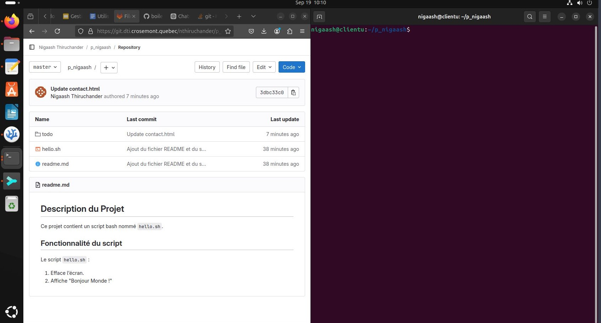
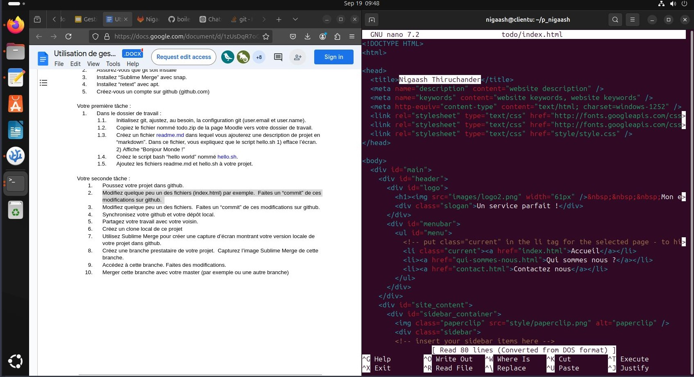
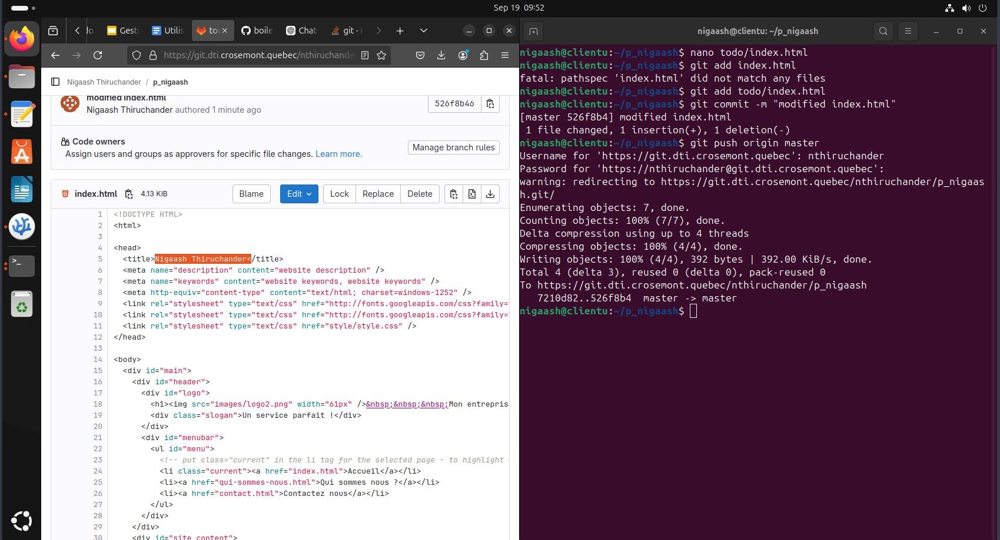
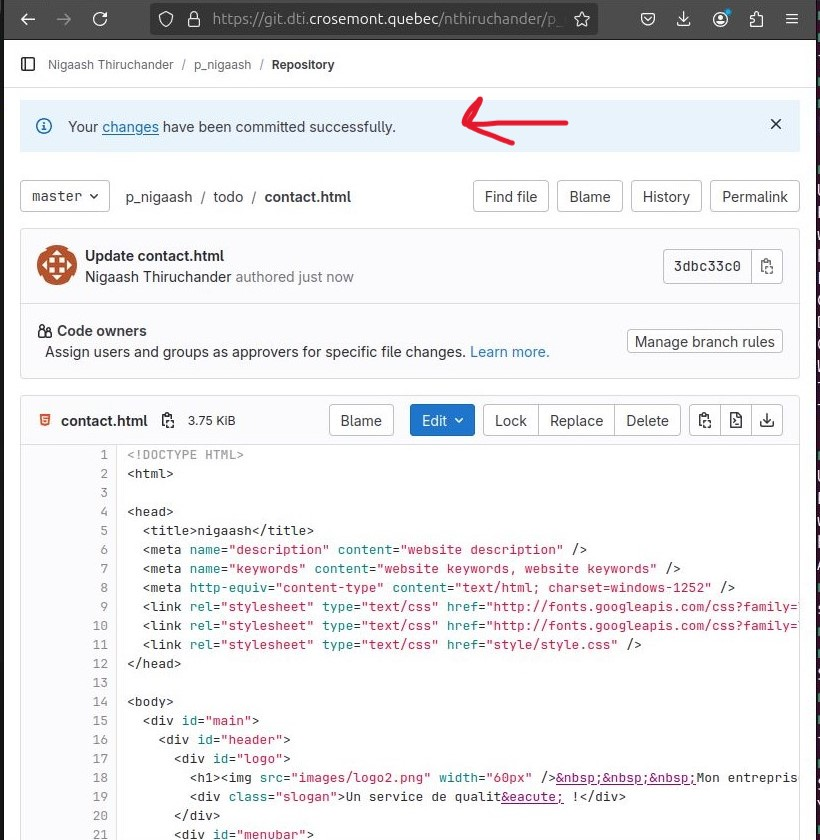
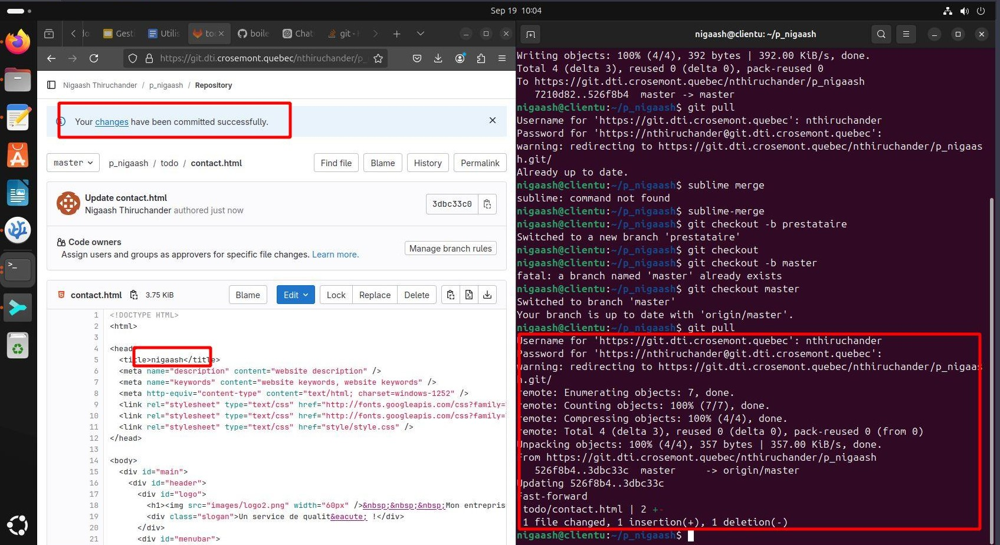
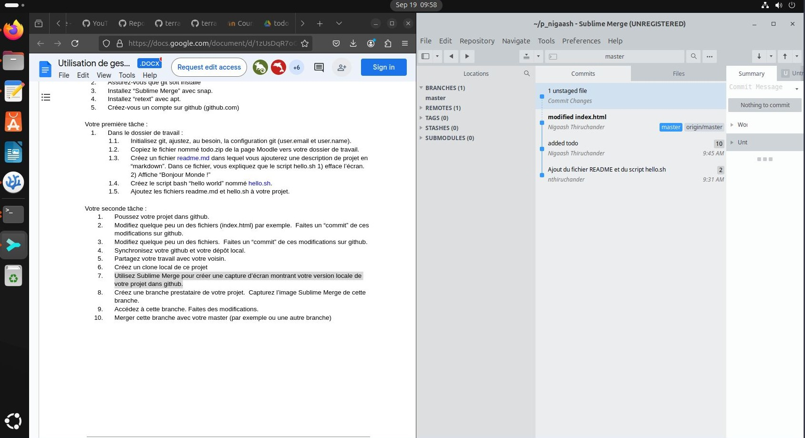
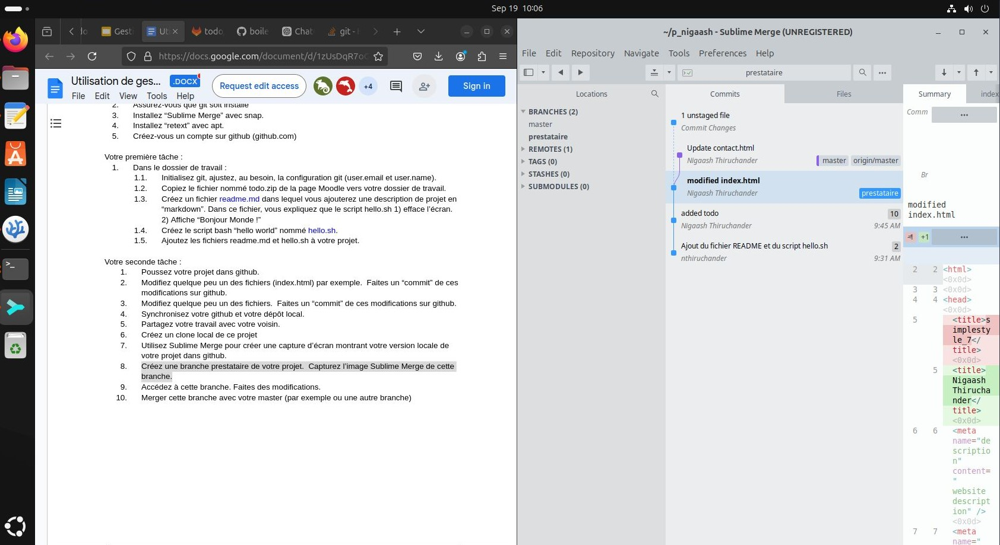
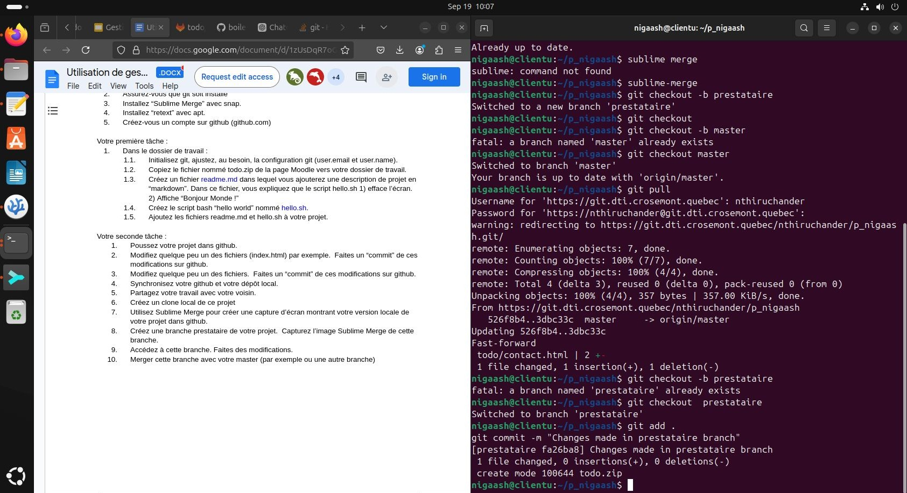
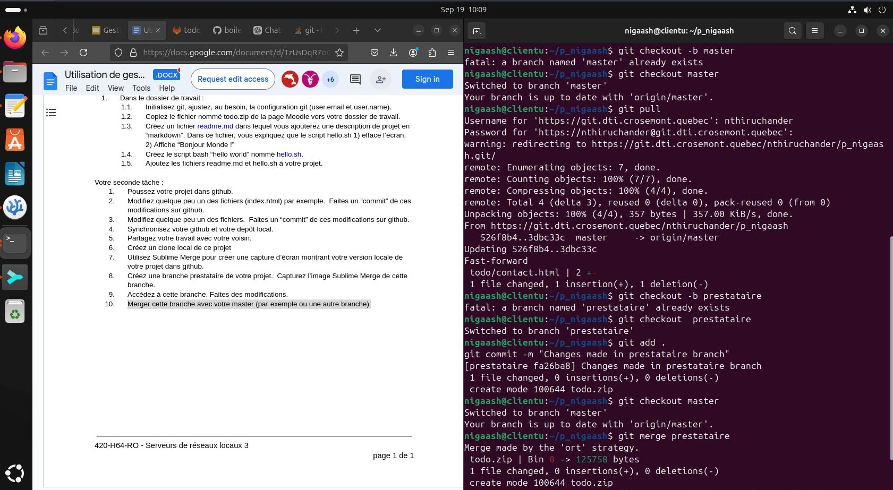

# [Laboratoire 3](<../../labs pdf/Laboratoire-3.pdf>)

## Préparation 
1. Dossier de travail pour votre projet.
    ```bash
    mkdir p_nigaash
    ```
2. Installation de git
    ```bash
    sudo apt install git
    snap install sublime-merge --classic
    sudo apt install retext
    ```

## Partie 1

cd p_nigaash/
1. Initilisez git
git init
2. Prendre le dossier todo de moodle
cp /home/nigaash/Downloads/todo.zip .
3. Crée readme
    ```bash
    nano readme.md
    ```
    ```markdown
    # Description du Projet

    Ce projet contient un script bash nommé `hello.sh`.

    ## Fonctionnalité du script

    Le script `hello.sh` :

    1. Efface l’écran.
    2. Affiche "Bonjour Monde !"
    ```
4. Script hello.sh
    ```bash
    touch hello.sh
    chmod +x hello.sh
    ```
    ```bash
    nano hello.sh
    ```
    ```bash
    #!/bin/bash
    clear
    echo "Bonjour monde!"
    ```
5. Ajoute de fichers dans projet
    ```bash
    git add readme.md hello.sh 
    git commit -m "Ajout du fichier README et du script hello.sh"
    ```

## Partie 2
1. add gitlab info
    ```bash
    git config --global user.name "Nigaash Thiruchander"
    git config --global user.email "nthiruchander@dept-info.crosemont.quebec"
    git remote add origin https://git.dti.crosemont.quebec/nthiruchander/p_nigaash
    ```
    push to gitlab
    ```bash
    git remote -v
    git push -u origin master
    ```
    

2. Modify en locale
    ```bash
    nano todo/index.html
    #change something
    git add todo/index.html
    git commit -m "modified index.html"
    git push origin master
    ```
    
    

3. Modifiy en gitlab
    
    ```bash
    git pull
    ```
    
    
4. sync
git pull origin master

5. 
    ```bash
    git clone <NEIGHBOR_REPOSITORY_URL>
    ```

6. deja en locale? ou la command git clone <lien>

7. Sublime merge pour montrer le projet
    

8. Creation du branch prestaire
    ```bash
    git checkout -b prestaire
    ```
    

9. Modification dans la branch prestaire
    ```bash
    touch titi
    git add .
    git commit -m "Changes made in prestataire branch"
    ```
    

10. Merge au brach master
    ```bash
    git checkout master
    git merge  prestataire
    ```
    
