--

# [laboratoire 7](<../../labs pdf/Laboratoire-7.pdf>)

### Goal utiliser ansible

**aller sur le site suivant pour installer ansible:**
[https://docs.ansible.com/ansible/latest/installation_guide/installation_distros.html](https://docs.ansible.com/ansible/latest/installation_guide/installation_distros.html)

**Utiliser les commandes suivant pour installer ansibe sur ubuntu**
```bash
sudo apt update
sudo apt install software-properties-common
sudo add-apt-repository --yes --update ppa:ansible/ansible
sudo apt install ansible
```
**Créer une paire de clé rsa et copier la clé vers vos machine ansible host**

```bash
ssh-keygen -t rsa -b 4096 -C "email@exemple.com"
ssh-copy-id -i ~/.ssh/id_rsa.pub utilisateur@ip_de_serveur
```

**aller dans le dossier ansible et modifier le fichier hosts**

```bash
cd /etc/ansible
sudo vim hosts
```

**ajouter vos ip de machine et autre information pertinent**

```bash
[webservers]
ip_de_serveur ansible_user=username ansible_ssh_private_key_file=~/.ssh/id_rsa

[database_servers]
ip_de_serveur ansible_user=username ansible_ssh_private_key_file=~/.ssh/id_rsa
```
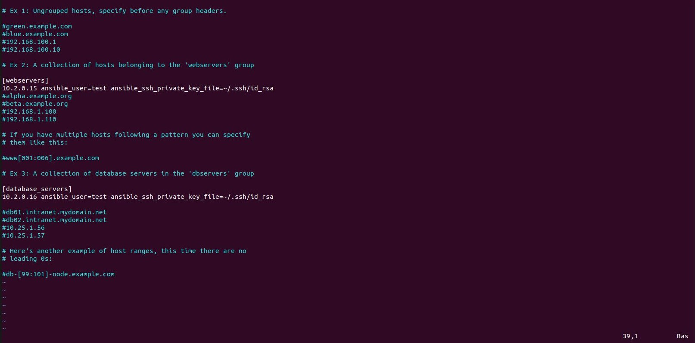

**utiliser la commande suivant pour voir la liste des hôtes:**

```baash
ansible-inventory list y
```
**Vous devrier voir quelque chose comme cela:**


**Pour tester la connectivté on va utiliser cette commande pour ping sur tous les hotes**
```bash
ansible all -m ping
```

**Vous devrier voir quelque chose comme cela:**

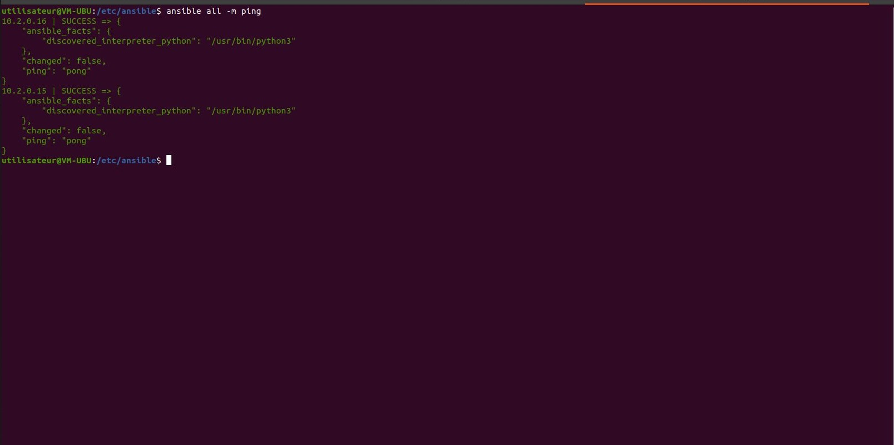

**Pour inster des application de la ligne de commande faiser ceci**

```bash
ansible all -m apt -a "name=application1, application2 state-present update_cache=yes" -b
```

**Pour mon test j'ai utiliser les application lynx et emacs**<br>
**Vous devrier voir quelque chose comme cela:**

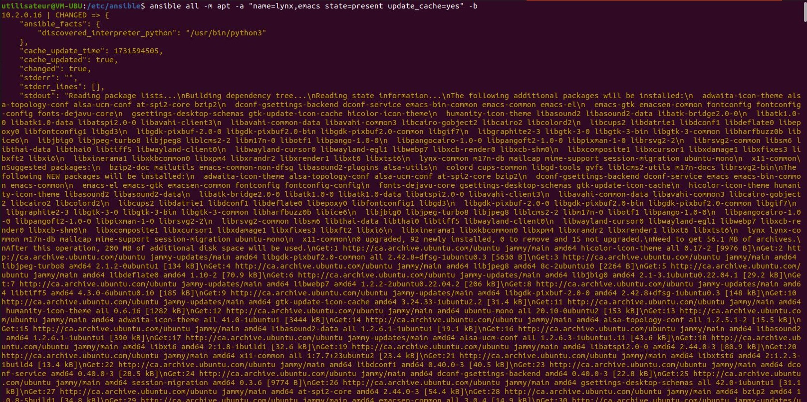

**Démonstration que emacs c'est bien installer**
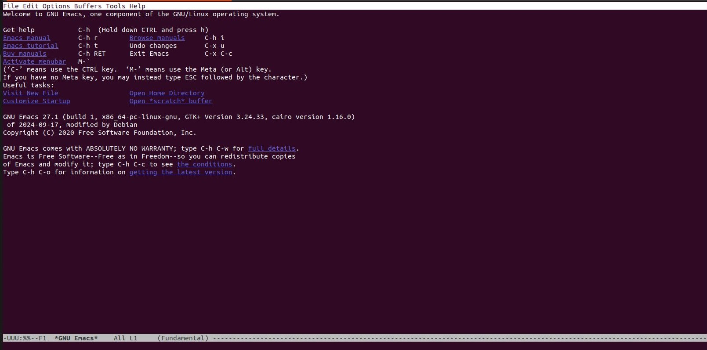

**Démonstration que lynx c'est bien installer**
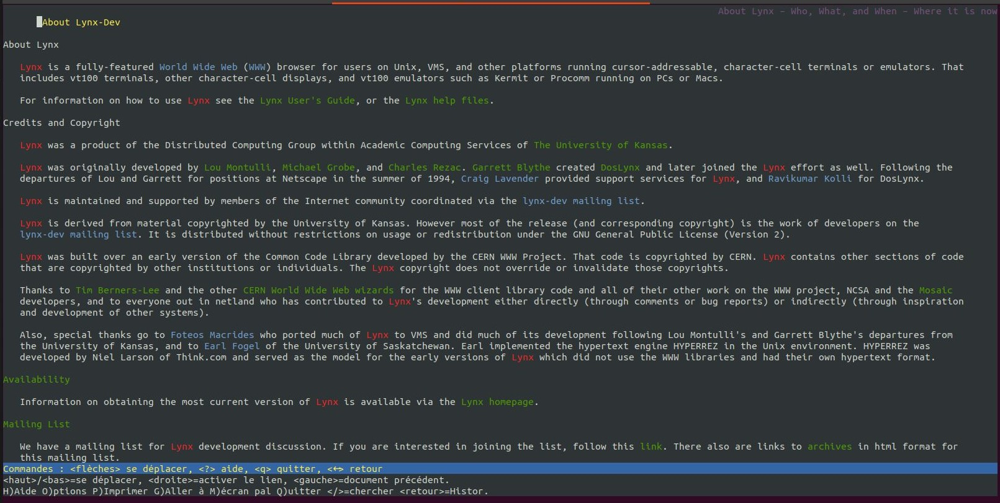

**Maintenant on va faire un playbook pour installer apache2 sur nos hôtes**

```bash
sudo vim apache.yml
```

```yaml
---
- hosts: webservers, database_servers
  become: yes
  tasks:
    - name: install apache2
      apt:
        name: apache2
        update_cache: yes
        state: latest

    - name: enable mod_rewrite
      apache2_module:
        name: rewrite
        state: present
      notify:
        - restart apache2

  handlers:
    - name: restart apache2
      service:
        name: apache2
        state: restarted

```

**Pour lancer le playbook entre cette commande:**
```bash
ansible-playbook apache.yml
```

**Vous devrier voir quelque chose comme cela:**
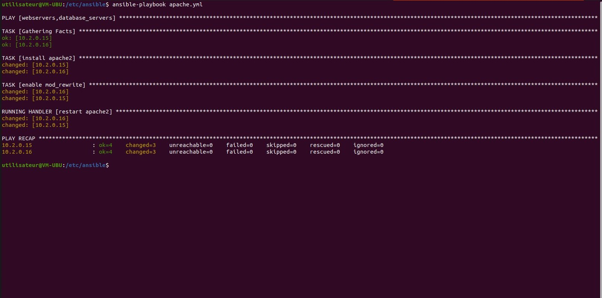

**Vous devrier voir quelque chose comme cela:**
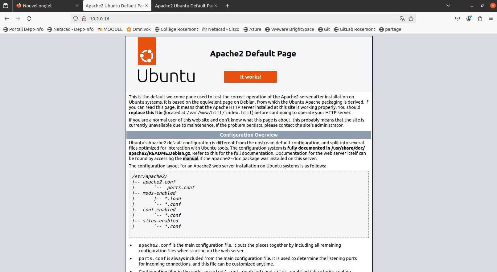
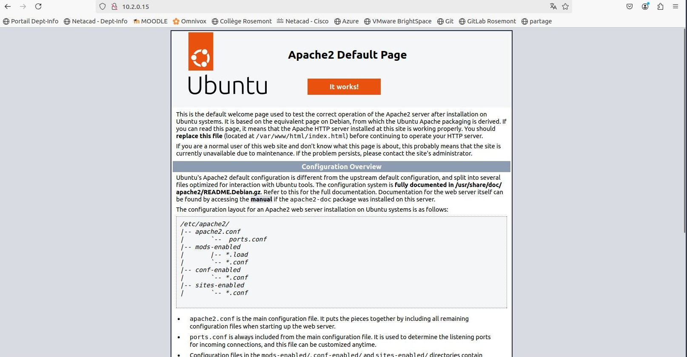

**Maintenant je vais faire un playbook qui install jenkins**

```bash
vim jenkins.yml
```

```yaml
- hosts: database_servers
  become: yes
  tasks:
    - name: étape 1
      get_url:
        url: https://pkg.jenkins.io/debian-stable/jenkins.io-2023.key
        dest: /usr/share/keyrings/jenkins-keyring.asc
        mode: '0644'

    - name: étape 2
      shell: |
        echo "deb [signed-by=/usr/share/keyrings/jenkins-keyring.asc] https://pkg.jenkins.io/debian-stable binary/" | tee /etc/apt/sources.list.d/jenkins.list > /dev/null

    - name: Update apt cache
      apt:
        update_cache: yes

    - name: Install Jenkins
      apt:
        name: jenkins
        state: present
        update_cache: yes

    - name: Install Java requirements
      apt:
        name:
          - fontconfig
          - openjdk-17-jre
          - openjdk-11-jdk
        state: present
        update_cache: yes
```

**pour lancer ce playbook utiliser la commande suivante:**
```bash
ansible-playbook jenkins.yml
```
**Vous devrier voir quelque chose comme cela:**
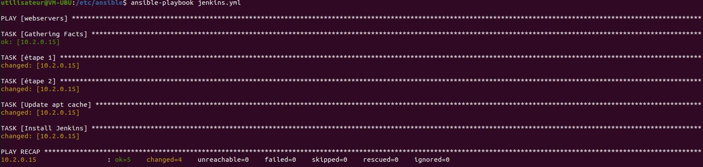

**Maintenant quand vous allez sur interface web des hôtes vous dervriez voir les étapes de création du compte admin ensuite ceci:**
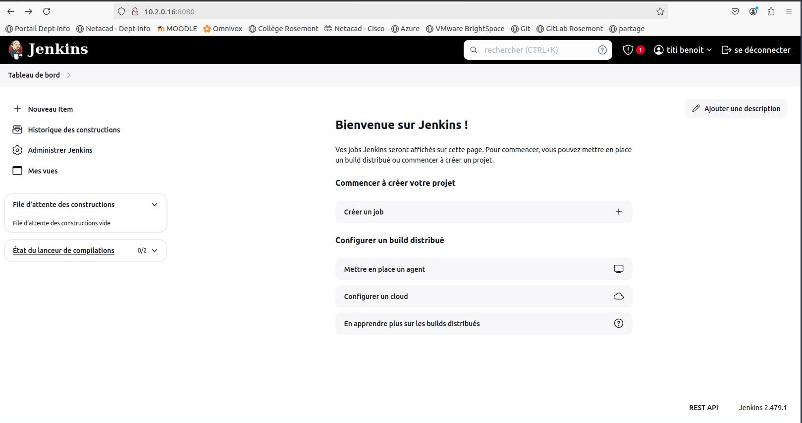

**Vous pouvez aussi installz des plugins ansible dans jenkins a cette endroit**
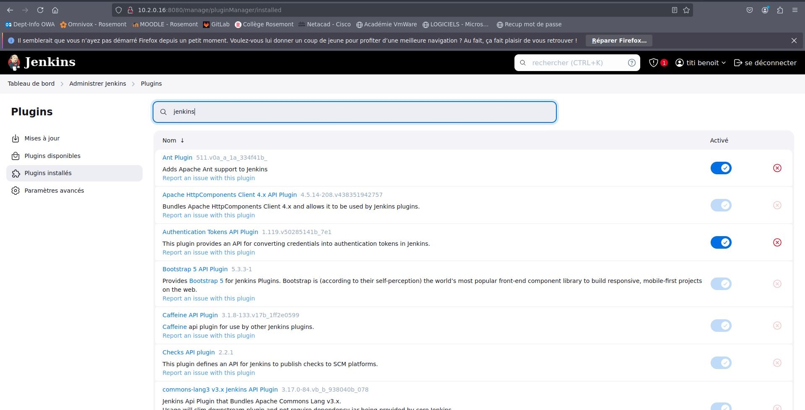

**Vou pouvez aussi initaliser vorte dosser /etc/ansible en tant que git pour tracker tous modification que vous faites**

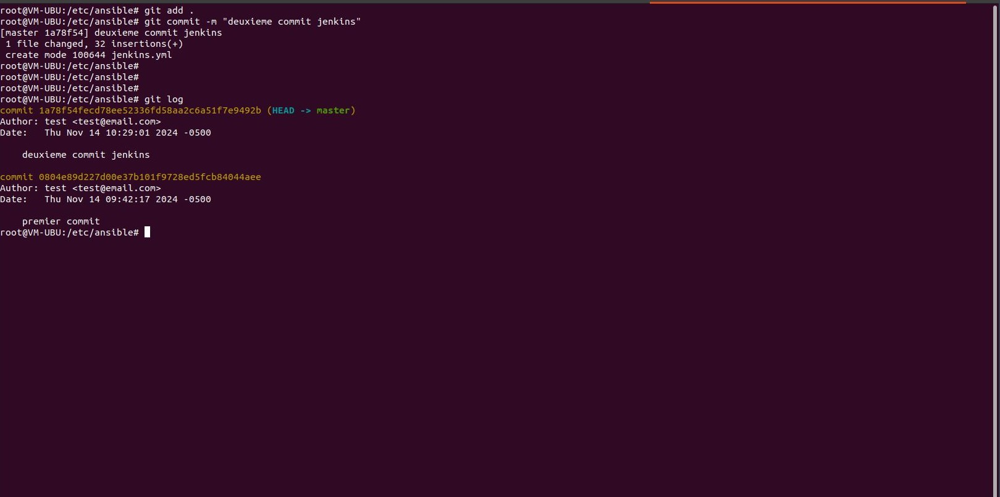

