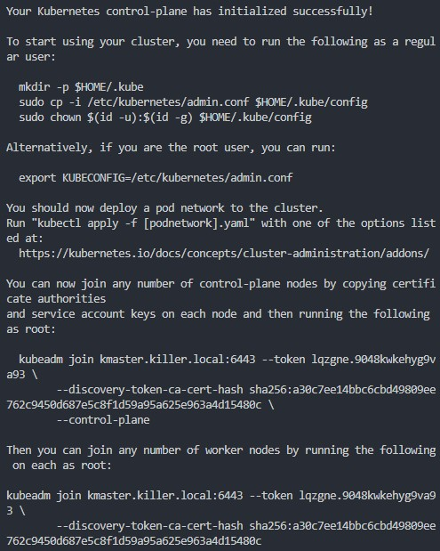
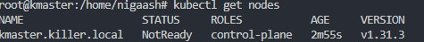
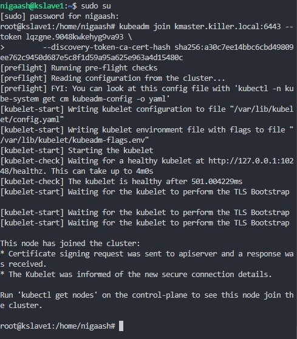
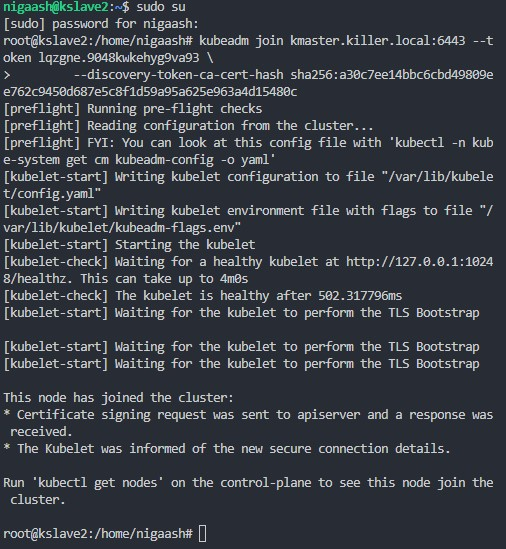
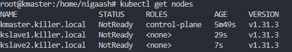
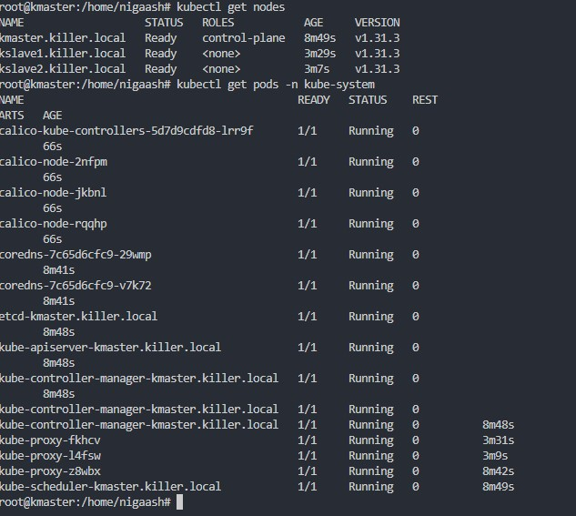
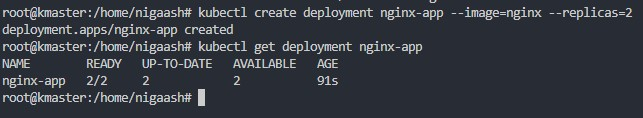
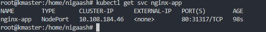
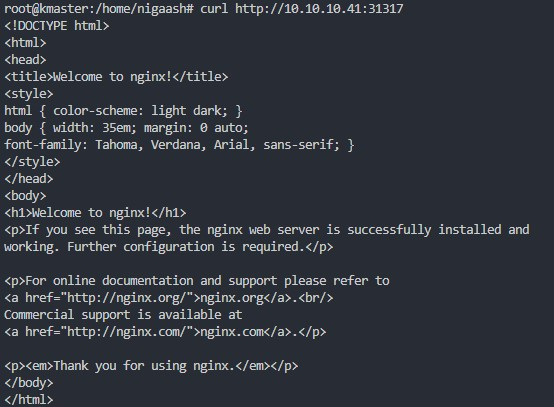
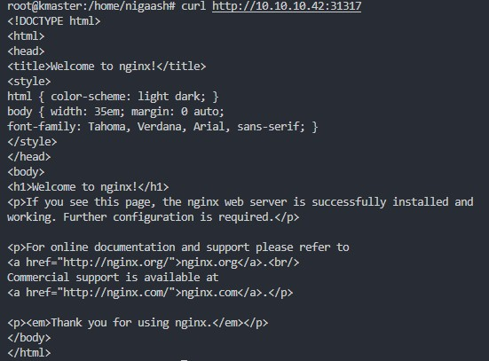

# [Laboratoire 9](<../../labs pdf/Laboratoire-9.txt>)

## Préparation 
1. Server Ubuntu 22.04 Kubernetics Master 
    - FQDN : kmaster.killer.local
    - IP 10.10.10.40
2. Server Ubuntu 22.04 Kubernetics Slave1 
    - FQDN : kslave1.killer.local
    - IP 10.10.10.41
3. Server Ubuntu 22.04 Kubernetics Slave2 
    - FQDN : kslave2.killer.local
    - IP 10.10.10.42
4. Minimum requirements: 
    - Ubuntu 22.04
    - Minimum 2GB RAM or more
    - Minimum 2 CPU cores / or 2 vCPU
    - 20 GB free disk space on /var or more
    - Sudo user with admin rights
    - Internet connectivity on each node

## Partie 1
[Lien pour tutorial Kubernetes Cluster](https://www.linuxtechi.com/install-kubernetes-on-ubuntu-22-04/)<br>

#### Définir le nom d'hôte du nœud maître
```bash
sudo hostnamectl set-hostname "kmaster.killer.local"
```
#### Définir le nom d'hôte du premier nœud de travail
```bash
#1st worker node
sudo hostnamectl set-hostname "kslave1.killer.local"
```
#### Définir le nom d'hôte du deuxième nœud de travail
```bash
#2nd worker node   
sudo hostnamectl set-hostname "kslave2.killer.local" 
```
#### Ajouter des entrées dans le fichier hosts pour la résolution des noms
```bash
10.10.10.40 kmaster.killer.local kmaster
10.10.10.41 kslave1.killer.local kslave1
10.10.10.42 kslave2.killer.local kslave2
```
#### Désactiver l'espace d'échange
```bash
sudo swapoff -a
sudo sed -i '/ swap / s/^\(.*\)$/#\1/g' /etc/fstab
```
#### Charger les modules nécessaires pour containerd
```bash
sudo tee /etc/modules-load.d/containerd.conf <<EOF
overlay
br_netfilter
EOF
```
#### Activer les modules overlay et br_netfilter
```bash
sudo modprobe overlay
sudo modprobe br_netfilter
```

#### Configurer les paramètres sysctl pour Kubernetes
```bash
sudo tee /etc/sysctl.d/kubernetes.conf <<EOT
net.bridge.bridge-nf-call-ip6tables = 1
net.bridge.bridge-nf-call-iptables = 1
net.ipv4.ip_forward = 1
EOT
```
#### Appliquer les configurations sysctl
```bash
sudo sysctl --system
sudo apt install -y curl gnupg2 software-properties-common apt-transport-https ca-certificates
```
#### Installer containerd
```bash
sudo curl -fsSL https://download.docker.com/linux/ubuntu/gpg | sudo gpg --dearmour -o /etc/apt/trusted.gpg.d/docker.gpg

sudo add-apt-repository "deb [arch=amd64] https://download.docker.com/linux/ubuntu $(lsb_release -cs) stable"

sudo apt update

sudo apt install -y containerd.io
```
#### Configurer containerd pour utiliser systemd
```bash
containerd config default | sudo tee /etc/containerd/config.toml >/dev/null 2>&1
sudo sed -i 's/SystemdCgroup \= false/SystemdCgroup \= true/g' /etc/containerd/config.toml
```
#### Installer kubelet, kubeadm et kubectl
```bash
curl -fsSL https://pkgs.k8s.io/core:/stable:/v1.31/deb/Release.key | sudo gpg --dearmor -o /etc/apt/keyrings/kubernetes-apt-keyring.gpg

echo 'deb [signed-by=/etc/apt/keyrings/kubernetes-apt-keyring.gpg] https://pkgs.k8s.io/core:/stable:/v1.31/deb/ /' | sudo tee /etc/apt/sources.list.d/kubernetes.list
sudo apt update

sudo apt install -y kubelet kubeadm kubectl
```
#### Empêcher la mise à jour automatique de kubelet, kubeadm et kubectl
```bash
sudo apt-mark hold kubelet kubeadm kubectl
```
#### Initialiser le cluster Kubernetes sur le nœud maître
```bash
sudo kubeadm init --control-plane-endpoint=kmaster.killer.local
```


#### Configurer kubectl pour l'utilisateur actuel
```
mkdir -p $HOME/.kube
sudo cp -i /etc/kubernetes/admin.conf $HOME/.kube/config
sudo chown $(id -u):$(id -g) $HOME/.kube/config
```
#### Afficher les informations du cluster Kubernetes
```bash
kubectl cluster-info
kubectl get nodes
```


#### Joindre un nœud de travail au cluster Kubernetes
```bash
kubeadm join kmaster.killer.local:6443 --token lqzgne.9048kwkehyg9va93 \
        --discovery-token-ca-cert-hash sha256:a30c7ee14bbc6cbd49809ee762c9450d687e5c8f1d59a95a625e963a4d15480c
```
node1




node2





#### Déployer Calico pour le réseau du cluster Kubernetes
```bash
kubectl apply -f https://raw.githubusercontent.com/projectcalico/calico/v3.26.0/manifests/calico.yaml
```
#### Lister les pods dans l'espace de noms kube-system et tous les nœuds du cluster
```bash
kubectl get pods -n kube-system
kubectl get nodes
```


#### Créer un déploiement Nginx avec 2 réplicas
```bash
kubectl create deployment nginx-app --image=nginx --replicas=2
```
#### Obtenir des informations sur le déploiement Nginx-app
```bash
kubectl get deployment nginx-app
```
<br>
##### Exposer à nouveau l'application Nginx via un service NodePort sur le port 80, si nécessaire
```bash
kubectl expose deployment nginx-app --type=NodePort --port=80
```
#### le service Nginx-app pour voir ses détails et son exposition réseau.
```bash
kubectl get svc nginx-app
kubectl describe svc nginx-app
```



#### les sites sont functional
```bash
http://10.10.10.40:31317
http://10.10.10.41:31317
http://10.10.10.42:31317
```

